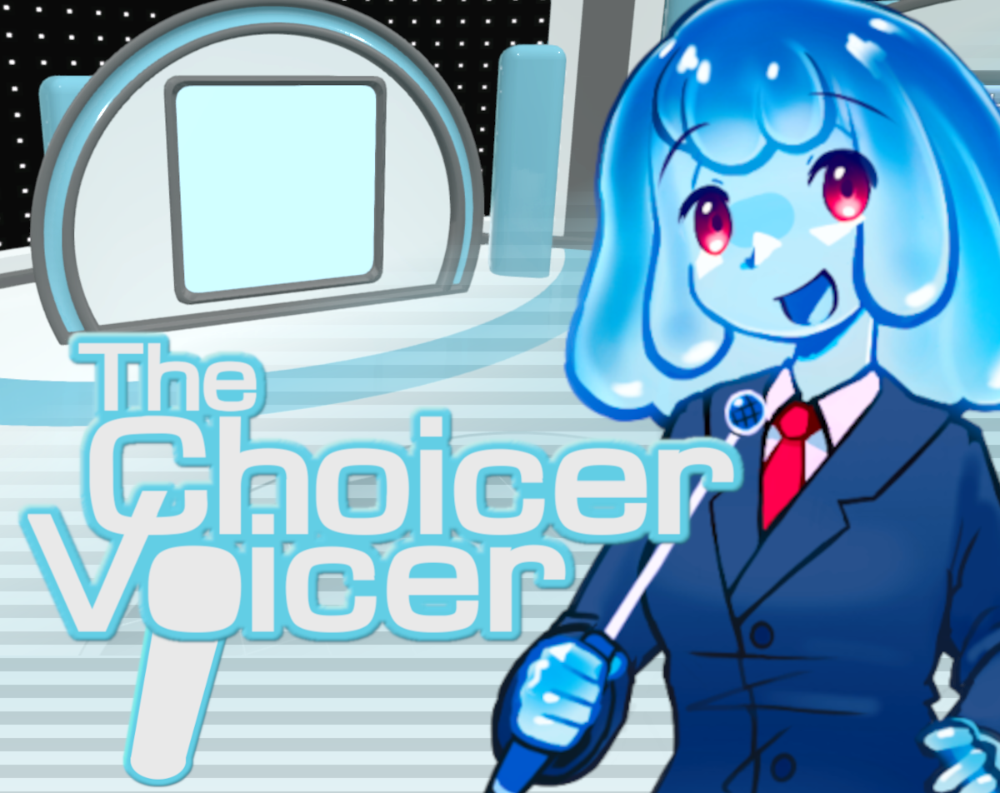

# The Choicer Voicer's Unwritten Rules: What the Judges Never Tell You

You load into an empty studio, judges already seated, and the only thing waiting in your library is a single test clip you dropped in five minutes ago. That's the first real moment in [The Choicer Voicer](https://thechoicervoicer.io): no roster of characters to pick, no tutorial level, just a stage, a microphone prompt, and a panel that's about to score whatever comes out of your mouth. It's an unusual way to open a game, and it tells you almost everything about how the rest of a session goes — nothing here is handed to you, and the first few minutes are spent building rather than playing.

| | |
|---|---|
| **Genre** | Voice impression party game |
| **Platforms** | Windows, Linux |
| **Players per studio** | 1–4 |
| **Core mechanic** | Listen to a reference clip, perform it aloud, get scored by the judges |

## The Studio Loop in The Choicer Voicer

Every round follows the same short shape: a reference clip plays through the studio speakers, you perform your version into a microphone, and a row of judges reacts before handing out a score. The rhythm is intentionally tight — a full round rarely runs long, which keeps a four-player group cycling through turns instead of stalling on one attempt. Because the judging is computer-driven rather than a friend eyeballing your delivery, the loop holds up fine as a solo warm-up too, without anyone needing to sit out and referee. Players who mostly show up for the competitive angle tend to run the same pack over and over, chasing a marginally higher score on clips they already know cold, sometimes replaying a single line a dozen times in one sitting just to shave a few points off a personal best.

What throws newcomers is how little the game explains about what actually earns points. There's no on-screen breakdown of pitch, timing, or clarity while you're performing, so the first few rounds tend to feel like guessing — you submit a take, a number appears, and you're left reverse-engineering why it landed where it did. Regulars talk about this constantly — it's one of the more debated parts of the game, since the panel's exact logic is never spelled out anywhere in the menus, only inferred from repeated play and compared notes between players. Some players go as far as keeping a running spreadsheet of which clips reward which delivery style, treating the whole system like an unsolved puzzle rather than something to just wing every time.

Once you've run ten or twelve rounds, patterns start showing up. Matching the rhythm of a clip tends to matter more than nailing an exact voice, and judges seem to punish long pauses harder than a slightly off pitch — miss a beat where the original speaker takes a breath, and the score drops noticeably even if the impression itself was close. None of that is confirmed anywhere in the studio's menus; it's community knowledge built from trial and error, and it's part of why players who take the game seriously keep a mental log of which clips reward which kind of delivery. A few regulars describe hitting a point, usually somewhere around their second or third pack, where the scoring stops feeling arbitrary and starts feeling like something they can actually read in advance.

## Filling Your First Voice Pack

The Choicer Voicer ships with almost nothing built in. The real first task isn't a round at all — it's assembling a voice pack, which is just a folder of audio clips the studio can pull reference material from. Beginners often grab whatever sound bites they already have saved and drop them in without checking length or audio quality, then wonder why the judges seem to score inconsistently from one clip to the next. Clips with background noise or uneven volume genuinely throw off the panel's read, so a bit of trimming before import saves frustration later — a clip that sounds fine to your own ear can still confuse the scoring if the levels are off, and there's no in-game warning that flags a bad import before you're already mid-round with it.

- Short clips under ten seconds tend to produce cleaner, more consistent rounds, because there's less room for pacing to drift between reference and performance, and a shorter clip is easier to hold in memory during the actual take.
- Clean audio without music beds scores more predictably than clips with a soundtrack behind them, since background music competes with the voice the panel is actually trying to judge, and it's easy to mistake a muddled score for a bad performance when the real culprit was the source file.
- Grouping clips by tone — dramatic, comedic, flat delivery — makes a pack easier to run through in one sitting, because performers can stay in one register instead of resetting their approach every round, which matters more than it sounds once fatigue sets in after a dozen straight performances.

By the time you've built two or three packs, the appeal of the format becomes obvious — you're not clearing content the developers made, you're curating a performance library that only exists because you built it. Players who lean more toward collecting and organizing than competing often end up spending as much time sorting clips into themed packs as they do actually performing in the studio, and a well-organized pack tends to circulate among a regular group the way a good playlist would.

## Dub Mode and Longer Performances in The Choicer Voicer

Dub Mode shifts the game away from short scored prompts into longer voiceover passes, where you're matching timing across a whole scene instead of one line. It's a different kind of pressure — less about a single clean take, more about staying in sync for thirty seconds or a minute without your delivery drifting off pace. A single mistimed pause early in a Dub Mode scene tends to compound, since everything after it has to catch back up to the reference audio, and by the halfway mark a small early slip can leave your delivery noticeably out of step with where the source clip actually is.

Players who stick with Dub Mode tend to be the ones who came in for the performance angle rather than the competitive scoring, and it's noticeably less forgiving of a shaky microphone. Where a standard round might survive a brief crackle or a stumbled word, a Dub Mode scene running a full minute gives far more time for a small audio problem to snowball into a take worth scrapping entirely. There's also a mental-stamina element that short rounds don't really test — holding a character's rhythm across a full minute is a different skill than nailing one punchy line, and it's the part of Dub Mode most players say takes the longest to get comfortable with.

Testing a short clip before committing to a full Dub Mode scene is standard advice in the community, mostly because a bad mic day can quietly tank a long take without you noticing until playback — by then you've spent several minutes on a performance the panel is going to score poorly through no fault of your actual delivery. Some players keep a short, familiar "check clip" specifically for this, running it before every Dub Mode session as a quick sanity test on input levels, a habit that regulars pass along to newer players almost as a rite of passage.

## Group Sessions and Chat-Driven Rounds

Up to four players can share one studio, taking turns at the microphone while everyone else watches the panel react. Assigning a specific microphone to each player before the first round matters more than it sounds — it's easy for one performer's voice to bleed into another's turn if input isn't locked down beforehand, and a session can lose several rounds to a scoring mixup before anyone notices whose audio actually got picked up. Groups who play regularly tend to settle into a fixed seating and mic arrangement specifically to avoid this, sometimes labeling inputs by name before a single round even starts.

Twitch streaming mode adds another layer on top of that: chat commands let an audience vote or trigger prompts, turning a private studio session into something closer to a live show. Viewers who'd otherwise just be watching get a way to actually shape which clip comes up next or how a close round gets decided, which changes the feel of a session considerably compared to a private four-player group working through a pack alone. A streamer running chat commands has to think about pacing differently too, since a chat-driven vote can stall a session that would otherwise move briskly through a pack.

Competitive players and viewers who just want to spectate end up wanting different things from the same session, and the chat command layer is really where those two groups meet — a streamer running a serious, score-focused session has to balance that against an audience that mostly wants chaos and funny clip choices, and the two goals don't always sit comfortably together. Some streamers solve this by splitting sessions in two, running a tighter scored segment first and opening the floor to chat-driven chaos afterward.

### What is Dub Mode in The Choicer Voicer?

Dub Mode replaces short judged prompts with a longer voiceover pass, asking players to match a full scene's timing and delivery rather than a single clip. It draws in players who want to perform rather than compete for a score, and it punishes drift or mistimed pauses far more than a standard round would, since there's more time across a full scene for a small timing error to snowball.

### How do voice packs work?

A voice pack is a folder of audio clips imported into the studio's library, and it supplies every reference clip used during judged rounds. Since the game includes almost none by default, building or downloading community packs is a required first step, not an optional extra, and pack quality directly affects how consistent scoring feels session to session — a sloppy pack can make even a strong performer look inconsistent.

### Can more than one person play at once?

Yes — a studio supports up to four players taking turns at the microphone, with the judges scoring each performance independently. Assigning microphones ahead of time prevents one player's audio from bleeding into another's round, which is one of the more common mistakes in a first group session and one of the easiest to avoid once a group knows to expect it.

None of this works without a decent microphone and a willingness to sound ridiculous in front of a judging panel that never explains its math, which is exactly the trade-off The Choicer Voicer asks you to accept. Between building a voice pack from scratch, chasing a cleaner take in Dub Mode, and keeping a four-player studio's microphones straight, the format rewards the same instinct every time: listen closely to the clip in front of you, then commit to the performance instead of overthinking it.
